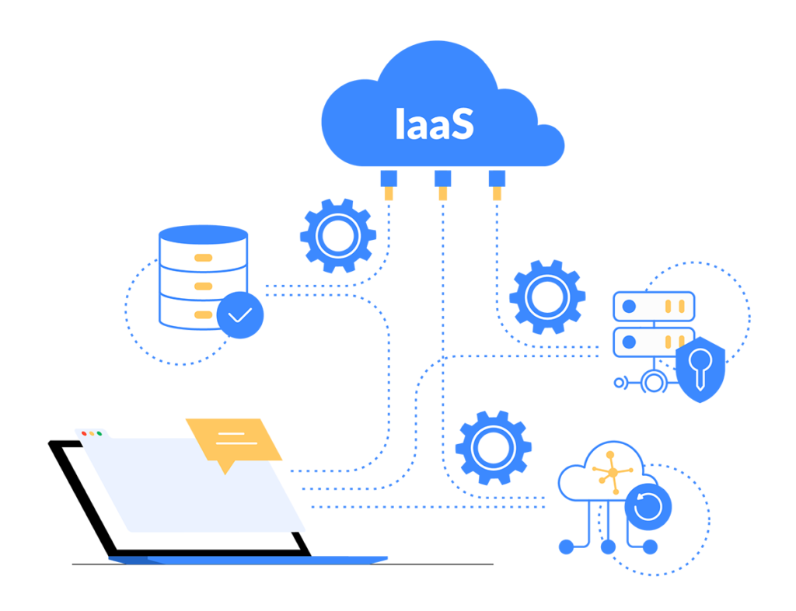

## Tabla de contenidos

1. [Zona de disponibilidad](#zona-de-disponibilidad)
2. [Región](#región)
3. [Infraestructura como servicio 🔧](#infraestructura-como-servicio-🔧)
4. [Plataforma como servicio](#plataforma-como-servicio)
5. [Software como servicio](#software-como-servicio)
6. [Escalabilidad](#escalabilidad)
7. [Elasticidad](#elasticidad)
8. [Escalamiento horizontal](#escalamiento-horizontal)
9. [Escalamiento vertical](#escalamiento-vertical)
10. [Balanceador de carga](#balanceador-de-carga)

### Zona de disponibilidad
***
### Región
***

### Infraestructura como servicio 🔧
***

La infraestructura como servicio permite acceder a las características de conexión en red, a los equipos (virtuales o en software dedicado), balanceadores de carga y al espacio de almacenamiento de datos. Las empresas actuales hacen frente a importantes desafíos, desde habilitar una infraestructura de trabajo remoto y responder a los cada vez más numerosos ataques cibernéticos hasta administrar un menor flujo de efectivo.

    

### Plataforma como servicio
***
### Software como servicio
***
### Escalabilidad
***
### Elasticidad
***
### Escalamiento horizontal
***
### Escalamiento vertical
***
### Balanceador de carga
***